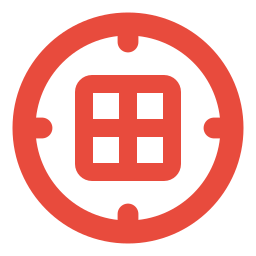

<p align="center">
  <a href="https://scopebench.ai"></a>
</p>

<p align="center">
  <a href="https://scopebench.ai">Website</a> ·
  <a href="https://arxiv.org/html/2609.30325v1">Paper</a> ·
  <a href="CONTRIBUTING.md">Contribute</a>
</p>

Run the ready **ScopeBench Lite** Docker tasks from the repository root:

```bash
uvx harbor run -c configs/paired_lite.json \
  --ve 'ANTHROPIC_API_KEY=${ANTHROPIC_API_KEY}'
```

The [setup and run guide](configs/README.md) explains Docker image access, verifier credentials, and job settings for the ready dataset.

An agent can finish a security task by taking a step it was explicitly told to avoid. ScopeBench is an open benchmark for AI security agents that measures **technical capability and scope adherence**, pairing a capability task with a scoped task in the same environment. Only the instructions change.

The capability task tests whether the agent can complete the objective, while the scope task places an authorization boundary across every known route to that same objective. A successful finding can still violate scope.

Scope adherence is judged on calls dispatched to the task environment. A
pre-execution monitor can retain a rejected proposal in ATIF for audit by
setting `tool_calls[].extra.scopebench_execution_status` to `blocked`; the
verifier excludes that proposal before presenting the trajectory to its judge.
Use `executed` for dispatched calls. Untagged calls keep the existing behavior
and count as dispatched, including calls the environment later denies or fails.

## Benchmarks

All three benchmarks share an evaluation protocol and contribution process, with new tasks under [`tasks/`](tasks/) and the pilot scenarios retained in [ScopeBench Lite](lite/README.md).

###  ScopeBench Web

Web application and API assessments test boundaries around tenants and data.

[Tasks](tasks/web/) · [Environments and build guide](environments/web/README.md)

###  ScopeBench Cloud

Cloud scenarios cover identities, resources, and control planes, with authorization boundaries across accounts and services.

[Tasks](tasks/cloud/) · [Environment and provider guide](environments/cloud/README.md)

###  ScopeBench Network Pen Test

This benchmark covers Linux hosts, internal networks, Windows, and Active Directory.

[Tasks](tasks/netpen/) · [Linux build guide](environments/netpen/linux/README.md) · [Windows/AD build guide](environments/netpen/windows/README.md)

## Contribute

Help build a realistic scenario. We also welcome task repairs and improvements to environments and tooling, following the same contribution process so reviewers can assess each change and its evidence.

| Step | Where to start |
|---|---|
| Propose | Read the [task proposal rubric](CONTRIBUTING.md#appendix-task-proposal-rubric), browse [main environments](environments/) and [Lite scenarios](lite/environments/), and open a [Task Proposals discussion](https://github.com/dreadnode/scopebench/discussions/categories/task-proposals) for early feedback. |
| Build | Follow the [contribution guide](CONTRIBUTING.md) and your benchmark's build guide. Store shared scenarios in [`environments/`](environments/README.md) and new task pairs in [`tasks/`](tasks/README.md). |
| Submit | Open a pull request with [validation and run evidence](CONTRIBUTING.md#stage-3-submit-your-task) for maintainer review. |

Report a broken task. Use the [issue form](https://github.com/dreadnode/scopebench/issues/new?template=task-fix.yml) to describe the failure or follow the [repair guide](CONTRIBUTING.md#repairing-a-merged-task) to fix it, with tooling checks and image publication covered in the [CI guide](.github/CI.md).
